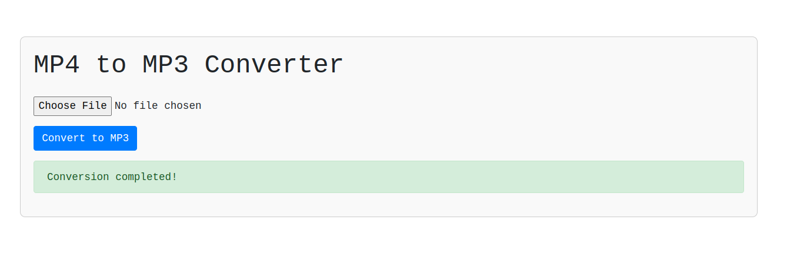

# MP4 to MP3 Converter using Flask and MoviePy

This is a simple web application built with Flask to convert MP4 video files to MP3 audio files using MoviePy library.

## Prerequisites

- Python installed on your machine.
- Required Python packages can be installed using `pip install flask moviepy`.

## How to Use

1. Clone or download this repository to your local machine.
2. Install the required packages as mentioned above.
3. Run the Flask application by executing the following command in your terminal:

    ```
    python app.py
    ```

4. Open your web browser and go to `http://127.0.0.1:5000/` to access the application.
5. Click on the 'Choose File' button to upload an MP4 video file.
6. Click the 'Convert' button to start the conversion process.
7. Once the conversion is completed, you'll be provided with a download link for the converted MP3 file.
8. Click on the download link to save the converted MP3 file to your local machine.

## Important Notes

- The converted MP3 file will have the same name as the uploaded MP4 file but with `_converted` appended to its name.
- The application is for educational and demonstration purposes and might require further optimizations for production use.
